# Procesverslag
Markdown is een simpele manier om HTML te schrijven.  
Markdown cheat cheet: [Hulp bij het schrijven van Markdown](https://github.com/adam-p/markdown-here/wiki/Markdown-Cheatsheet).

Nb. De standaardstructuur en de spartaanse opmaak van de README.md zijn helemaal prima. Het gaat om de inhoud van je procesverslag. Besteedt de tijd voor pracht en praal aan je website.

Nb. Door *open* toe te voegen aan een *details* element kun je deze standaard open zetten. Fijn om dat steeds voor de relevante stuk(ken) te doen.

## Jij

  
uitwerken voor kick-off werkgroep

  ### Auteur:
  Roan Boersma

  #### Je startniveau:
  Rood

  #### Je focus:
  Responsive 1a/b, als alles soepel gaat 1c, en als dan alles echt heel makkelijk loopt ga ik voor responsive en surface
 

## Je website

  
uitwerken voor kick-off werkgroep

  ### Je opdracht:
 [https://www.zalando.nl/heren-home/ ](https://www.zalando.nl/heren-home/)](https://www.zalando.nl/wardrobe-essentials-heren/?_rfl=en)

  #### Screenshot(s) van de eerste pagina (small screen): 
  Homepagina zalando mannen,
  De homepagina veranderd steeds dus het zal ongeveer de zelfde layout hebben met mogelijk andere kleuren en andere content. Dit is het geval door advertenties.
  

  #### Screenshot(s) van de tweede pagina (small screen):
  Detail pagina voor item: STRIPED JACKET Unisex - Denim jacket - white van Blkvis. recommended items kunnen mogelijk overtijd aangepast worden. In dat geval zal ik een ander item als vervanging gebruiken.  
  
 

## Toegankelijkheidstest 1/2 (week 1)

  
uitwerken na test in 2e werkgroep

 ### Content

 - Er wordt geen jargon gebruikt, behalve wanneer het gaat om termen zoals de naam van een kledingstuk, het type kledingstuk of collecties van merken.
 - De alt-tags ontbreken soms volledig, en wanneer ze wel aanwezig zijn, zijn ze niet descriptief genoeg.
  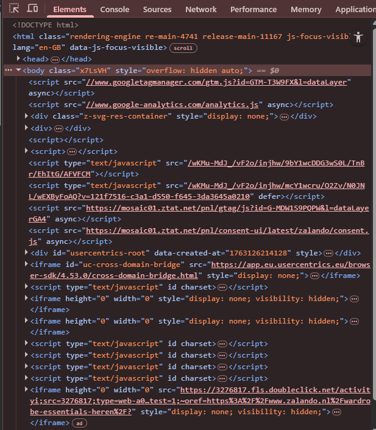

 ### Global code

 - De HTML bevat veel fouten
  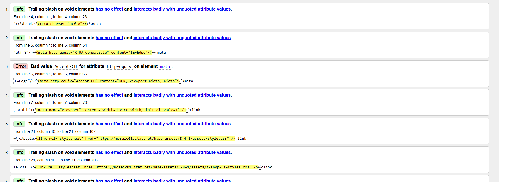
  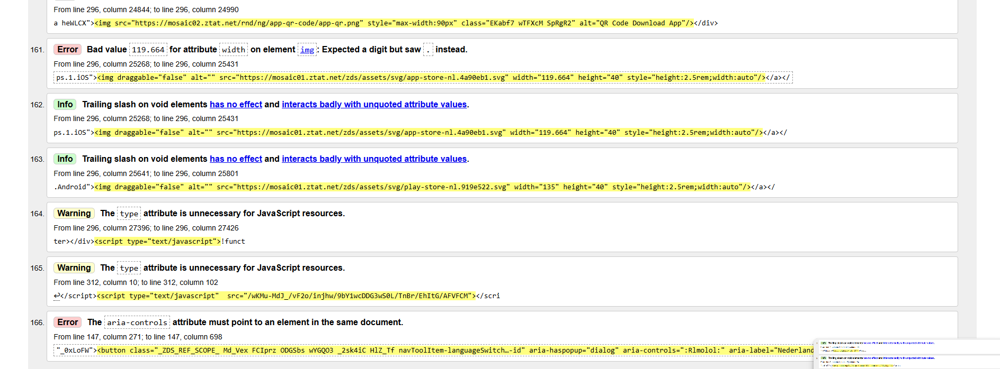
 - De HTML bevat een lang-attribuut, die verandert afhankelijk van de taalkeuze.
 - 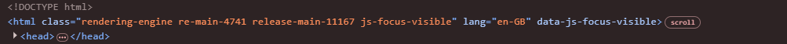
 - De website heeft een h1 op de pagina. Semantisch is dit volgens mij correct, maar de h1 staat onderaan, wat ongebruikelijk is en het lastig maakt om dit in de inspector goed te lezen.
 - 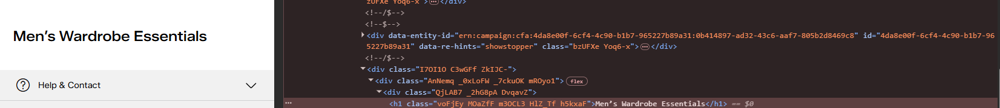
 - De viewport-zoom is niet disabled.
   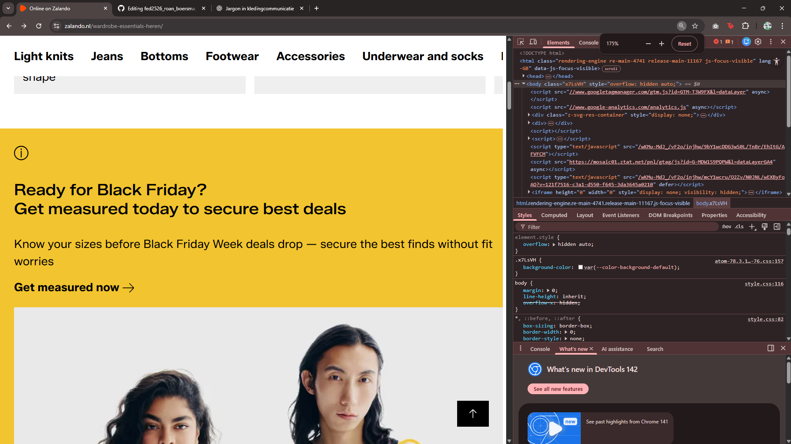

 ### Keyboard

 - Er is een zichtbare focus-stijl aanwezig, maar het contrast is laag.
  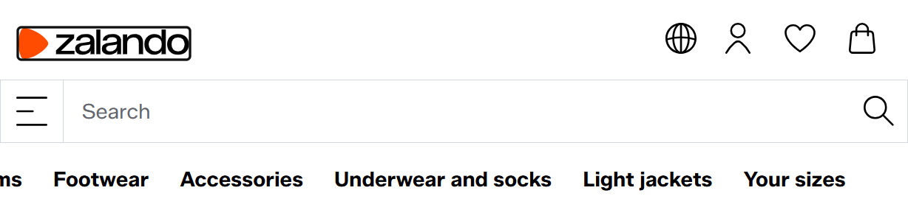
 - De keyboard-focus volgt een logische volgorde, wat overeenkomt met de visuele orde.

 ### Mobile and touch
 - Ja, dat is mogelijk. Het werkt dan niet helemaal optimaal, maar functioneert wel.
  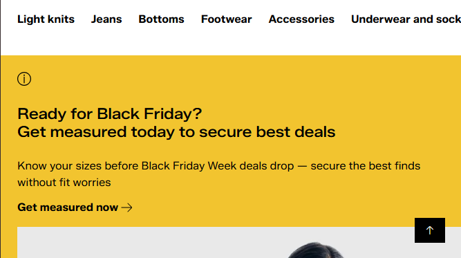
 - Er is geen horizontale scroll, tenzij dit bewust is toegepast.
 - Voor mij zijn de knoppen groot genoeg, maar voor iemand met grotere vingers kan dit een probleem vormen.
 - Ik klik niet per ongeluk op links of knoppen. Er blijkt dus voldoende ruimte te zijn om te scrollen.

 ### Headings
 - In het geheel wordt elke sectie correct geïntroduceerd, maar bij een aantal secties ontbreekt een h2. In plaats daarvan begint de sectie met een p of span-element.
  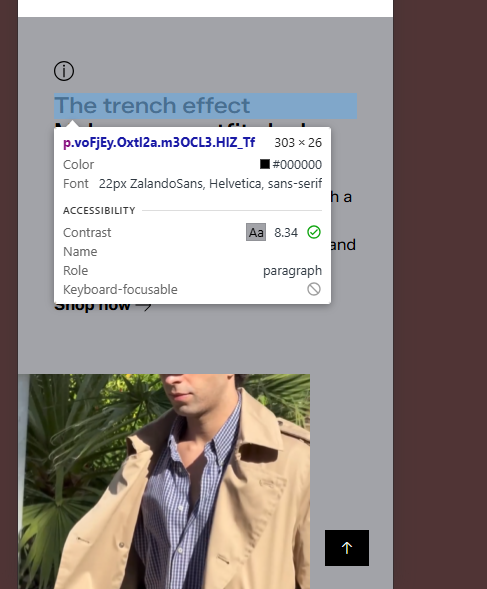
 - Er is maar één h1 per pagina. Bij sommige pagina's staat deze onderaan, zoals eerder benoemd.
 - De website slaat geen headings over, maar gebruikt ze wel op een aparte manier. Zo zitten er bijvoorbeeld een div en een span binnen een h2, in plaats van dat er correct een h2 gevolgd wordt door een h3.
   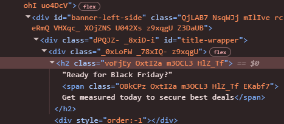

 ### Lists
  - De ul bevat de li-elementen als kinderen en wordt gebruikt voor de juiste content. Alleen wordt bijvoorbeeld geen nav-element gebruikt, maar een div om dit te wrappen.
    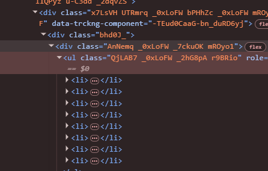
    
 ### Images

  - De afbeeldingen bevatten alt-tags die een duidelijke omschrijving van de foto geven.
    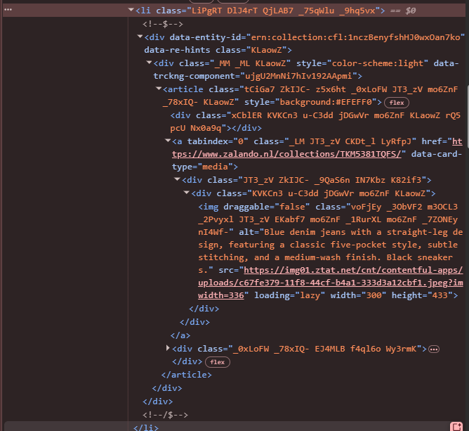
  - N/A
  - N/A
  - N/A
 
 ### Media
  - De video staat op autoplay, maar is wel gemute.
  - Alle media kan gepauzeerd worden.
  - Volgens mij bevat de video geen captions, maar het is waarschijnlijk meer bedoeld als decoratieve video.
  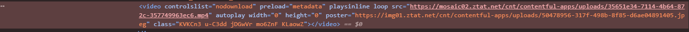
  - N/A

 ### Controls
  - Ja, het a element wordt correct gebruikt voor links.
  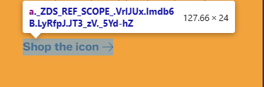
  - Links zien er over het algemeen uit als links, maar sommige links lijken eerder op buttons.
  - 
  - Alle controls hebben een focus-state.
    
  - Voor buttons wordt het juiste element gebruikt
  - De website bevat skip-links, die alleen zichtbaar zijn wanneer ze gefocust zijn.
  - 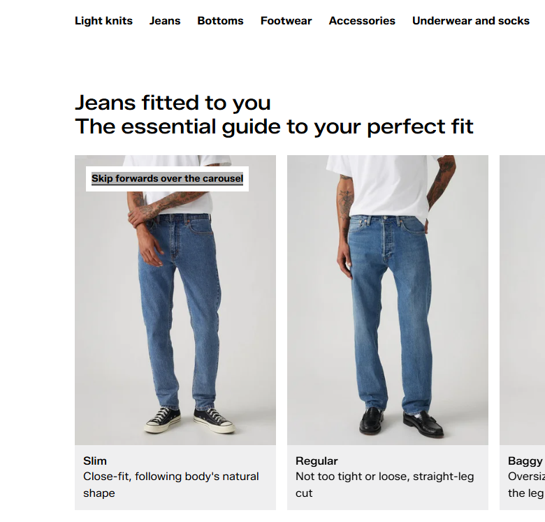
  - N/A
    
 ### Appearence
  - Nee
  - Het werkt, maar het ziet er niet bepaald mooi uit.
    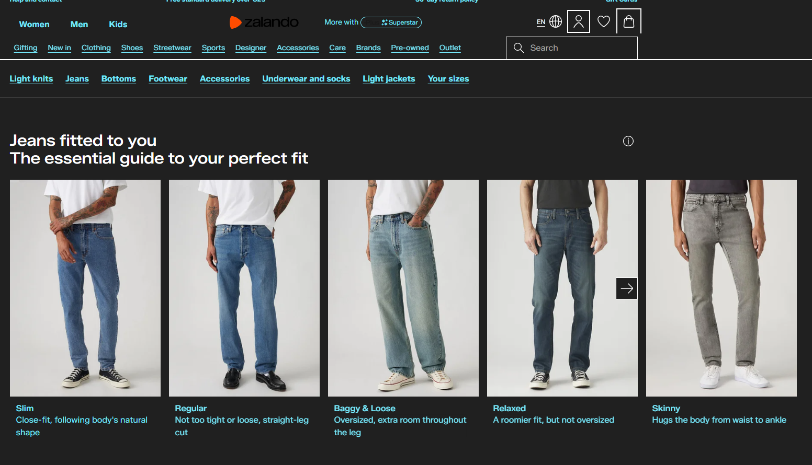
  - De tekst kan worden vergroot tot 200%.
  - Alle informatie, behalve de focus, wordt op twee manieren overgebracht.

 ### Appearence
  - De animatie van de like-knop is vrij snel, maar vormt geen probleem.
  - N/A
  - Dit kan ik niet vinden.

 ### Color contrast
  - Alles heeft dezelfde kleur...
  - N/A
  - Dit kan ik niet vinden.

## Breakdownschets (week 1)

  
uitwerken na afloop 3e werkgroep

  ### de hele pagina: 
  Breakdown schets van de detail pagina
  

  ### dynamisch deel (bijv menu): 
  Breakdown van een paar menu's op de detail pagina
  

  ### wellicht nog een dynamisch deel (bijv filter): 
  

## Voortgang 1 (week 2)

  
uitwerken voor 1e voortgang

  ### Stand van zaken

  - Alt tags zijn goed en discriptive.
  - Volgorde van h2 naar h3 en dergelijke elements wordt correct toe gepast.
  - Sommige tags die nu gebruikt worden zijn niet correct aangezien deze een eigen element hebben die daarvoor gebruikt kan worden denk aan, data, tijd, prijs.
  - 

  ### Agenda voor meeting
  samen met je groepje opstellen

  Roan   
  - Wat zijn de correcte elements voor: tijd, prijs, etc.
  - Gebruik van elements, is nu juist?
  - Is de nesting in de footer correct?
  - Heb ik de SVG's juist uitgevoerdt
  - Code voor invis class.

  
  Sidney
  
  Tyneisha 
  
  Lam 
  

  ### Verslag van meeting
  hier na afloop snel de uitkomsten van de meeting vastleggen

  - Een aantal elementen moeten binnen een unordered-list inplaats van hoe het nu staat, dit geld voor alle ul li items die momenteel in mijn footer staan.

  
  - Pricing elements, time elements

  -  Invis class is te vinden op brightspace
  -  Data element voor tijd / datum
  -  Verder gaat het de jusite kant op en moet ik gewoon lekker verder gaan met de HTML voor de tweede pagina, voordat ik aab de css ga werken.

## Voortgang 2 (week 3)

  
uitwerken voor 2e voortgang

  ### Stand van zaken
  hier dit ging goed & dit was lastig (neem ook screenshots op van delen van je website en code)

  ### Agenda voor meeting
  samen met je groepje opstellen

  ###Roan:
  Font-face werkt niet

  ### Verslag van meeting

  Ga verder zoals je bezig bent.
  @font-face was niet juist gelinkt.
  Gebruik geen margin, dit zorgt voor vervelende problemen.
  

## Toegankelijkheidstest 2/2 (week 4)

  
uitwerken na test in 9e werkgroep

  ### Bevindingen

  - Ik heb de focus-styling verbeterd, zodat er duidelijk contrast is.
  - Ik heb per link minimaal twee manieren toegevoegd om aan te tonen dat deze in focus is.
  - Ik heb alle img's een alt tag toegewezen.
  - De video staat niet meer op auto play.
  - <Nav> wordt nu gebruikt waar dat nodig is

## Voortgang 3 (week 4)

  
uitwerken voor 3e voortgang

  ### Stand van zaken
  hier dit ging goed & dit was lastig (neem ook screenshots op van delen van je website en code)

  ### Agenda voor meeting
  samen met je groepje opstellen

  ##Roan: 
  Custom buttons voor video

  ### Verslag van meeting

  Geen oplossing voor de vraag, assistent docent wist hier de oplossing nier voor, moet zelf gaan zoeken.
  Verder ziet alles er met 1 blik prima uit, ga verder zoals je bezig bent.
  <del> inplaats van <s>
  

## Eindgesprek (week 5)

  
uitwerken voor eindgesprek

  ### Je uitkomst - karakteristiek screenshots:
  

  ### Dit ging goed/Heb ik geleerd: 
  Korte omschrijving met plaatjes

  

  ### Dit was lastig/Is niet gelukt:
  Korte omschrijving met plaatjes

  

## Bronnenlijst

  
continu bijhouden terwijl je werkt

  Nb. Wees specifiek ('css-tricks' als bron is bijv. niet specifiek genoeg). 
  Nb. ChatGpT en andere AI horen er ook bij.
  Nb. Vermeld de bronnen ook in je code.

  1. [bron 1 voor de svg's zodat ik ze nogsteed kan aanpassen](https://www.svgviewer.dev/)
  2. [bron 2 (Grid info: ](https://www.youtube.com/watch?v=SIvCb7Ze2HA&t=982s)
  3. [bron 3 (Flexbox info:](https://www.youtube.com/watch?v=euEYZ4DtIG0&t=11064s)
  4. [bron 4 (Time element:](https://developer.mozilla.org/en-US/docs/Web/HTML/Reference/Elements/time)

