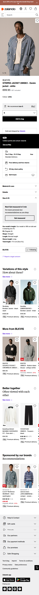

# Procesverslag
Markdown is een simpele manier om HTML te schrijven.  
Markdown cheat cheet: [Hulp bij het schrijven van Markdown](https://github.com/adam-p/markdown-here/wiki/Markdown-Cheatsheet).

Nb. De standaardstructuur en de spartaanse opmaak van de README.md zijn helemaal prima. Het gaat om de inhoud van je procesverslag. Besteedt de tijd voor pracht en praal aan je website.

Nb. Door *open* toe te voegen aan een *details* element kun je deze standaard open zetten. Fijn om dat steeds voor de relevante stuk(ken) te doen.

## Jij

  
uitwerken voor kick-off werkgroep

  ### Auteur:
  Roan Boersma

  #### Je startniveau:
  Rood

  #### Je focus:
  Responsive 1a/b, als alles soepel gaat 1c, en als dan alles echt heel makkelijk loopt ga ik voor responsive en surface
 

## Je website

  
uitwerken voor kick-off werkgroep

  ### Je opdracht:
 [https://www.zalando.nl/heren-home/ ](https://www.zalando.nl/heren-home/)](https://www.zalando.nl/wardrobe-essentials-heren/?_rfl=en)

  #### Screenshot(s) van de eerste pagina (small screen): 
  Homepagina zalando mannen,
  De homepagina veranderd steeds dus het zal ongeveer de zelfde layout hebben met mogelijk andere kleuren en andere content. Dit is het geval door advertenties.
  

  #### Screenshot(s) van de tweede pagina (small screen):
  Detail pagina voor item: STRIPED JACKET UNISEX - Denim jacket - white van BLKVIS. recommended items kunnen mogelijk overtijd aangepast worden. In dat geval zal ik een ander item als vervanging gebruiken.  
  
 

## Toegankelijkheidstest 1/2 (week 1)

  
uitwerken na test in 2e werkgroep

  ### Bevindingen
  Lijst met je bevindingen die in de test naar voren kwamen:

## Breakdownschets (week 1)

  
uitwerken na afloop 3e werkgroep

  ### de hele pagina: 
  Breakdown schets van de detail pagina
  

  ### dynamisch deel (bijv menu): 
  Breakdown van een paar menu's op de detail pagina
  

  ### wellicht nog een dynamisch deel (bijv filter): 
  

## Voortgang 1 (week 2)

  
uitwerken voor 1e voortgang

  ### Stand van zaken

  - Alt tags zijn goed en discriptive.
  - Volgorde van h2 naar h3 en dergelijke elements wordt correct toe gepast.
  - Sommige tags die nu gebruikt worden zijn niet correct aangezien deze een eigen element hebben die daarvoor gebruikt kan worden denk aan, data, tijd, prijs.
  - 

  ### Agenda voor meeting
  samen met je groepje opstellen

  Roan   
  - Wat zijn de correcte elements voor: tijd, prijs, etc.
  - Gebruik van elements, is nu juist?
  - Is de nesting in de footer correct?
  - Heb ik de SVG's juist uitgevoerdt
  - Code voor invis class.

  
  Sidney
  
  Tyneisha 
  
  Lam 
  

  ### Verslag van meeting
  hier na afloop snel de uitkomsten van de meeting vastleggen

  - Een aantal elementen moeten binnen een unordered-list inplaats van hoe het nu staat, dit geld voor alle ul li items die momenteel in mijn footer staan.

  
  - Pricing elements, time elements

  -  Invis class is te vinden op brightspace
  -  Data element voor tijd / datum
  -  Verder gaat het de jusite kant op en moet ik gewoon lekker verder gaan met de HTML voor de tweede pagina, voordat ik aab de css ga werken.

## Voortgang 2 (week 3)

  
uitwerken voor 2e voortgang

  ### Stand van zaken
  hier dit ging goed & dit was lastig (neem ook screenshots op van delen van je website en code)

  ### Agenda voor meeting
  samen met je groepje opstellen

  | student 1      | student 2          | student 3    | student 4        |
  | ---            | ---                | ---          | ---              |
  | dit bespreken  | en dit             | en ik dit    | en dan ik dat    |
  | en dat ook nog | dit als er tijd is | nog een punt | dit wil ik zeker |
  | ...            | ...                | ...          | ...              |

  ### Verslag van meeting
  hier na afloop snel de uitkomsten van de meeting vastleggen

  - punt 1
  - punt 2
  - nog een punt
- ...

## Toegankelijkheidstest 2/2 (week 4)

  
uitwerken na test in 9e werkgroep

  ### Bevindingen
  Lijst met je bevindingen die in de test naar voren kwamen (geef ook aan wat er verbeterd is):

## Voortgang 3 (week 4)

  
uitwerken voor 3e voortgang

  ### Stand van zaken
  hier dit ging goed & dit was lastig (neem ook screenshots op van delen van je website en code)

  ### Agenda voor meeting
  samen met je groepje opstellen

  | student 1      | student 2          | student 3    | student 4        |
  | ---            | ---                | ---          | ---              |
  | dit bespreken  | en dit             | en ik dit    | en dan ik dat    |
  | en dat ook nog | dit als er tijd is | nog een punt | dit wil ik zeker |
  | ...            | ...                | ...          | ...              |

  ### Verslag van meeting
  hier na afloop snel de uitkomsten van de meeting vastleggen

  - punt 1
  - punt 2
  - nog een punt
  - ...

## Eindgesprek (week 5)

  
uitwerken voor eindgesprek

  ### Je uitkomst - karakteristiek screenshots:
  

  ### Dit ging goed/Heb ik geleerd: 
  Korte omschrijving met plaatjes

  

  ### Dit was lastig/Is niet gelukt:
  Korte omschrijving met plaatjes

  

## Bronnenlijst

  
continu bijhouden terwijl je werkt

  Nb. Wees specifiek ('css-tricks' als bron is bijv. niet specifiek genoeg). 
  Nb. ChatGpT en andere AI horen er ook bij.
  Nb. Vermeld de bronnen ook in je code.

  1. [bron 1](https://chatgpt.com/share/68cadc12-ebe0-800c-804e-4ffe68e9aba7 voor de  svg)
  2. [bron 2](Grid info: https://www.youtube.com/watch?v=SIvCb7Ze2HA&t=982s)
  3. [bron 3](Flexbox info: https://www.youtube.com/watch?v=euEYZ4DtIG0&t=11064s)
  4. 

